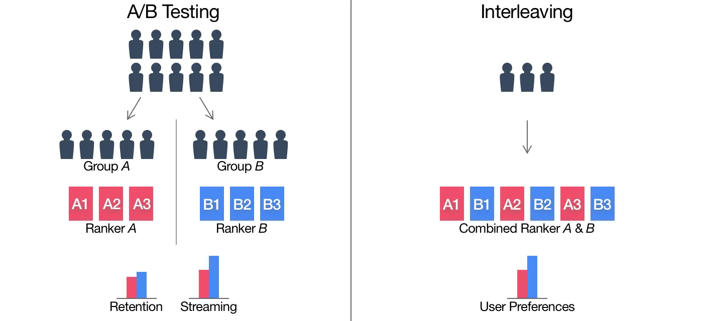

# Data Scientist

Welcome to my professional page! I'm Edgar, a passionate and experienced data scientist specializing in user behaviour analysis. With a background in computer science, I have extensive experience turning data into insights, driving business strategies, and solving complex problems with data.

- **Programming Languages**: Python, R, SQL
- **Libraries & Tools**: PySpark, scikit-learn, SciPy, PyTorch, Databricks, AWS, Jupyter Notebook, Microsoft SQL Server, Git, Looker, Jira, Confluence
- **Skills**: Statistics, Machine Learning, A/B Testing and Interleaving, Data Analytics, Algorithms, Research, Project Management, Public Speaking

---

## **Education**
- MS in Data Science - **IU International University of Applied Sciences** (2023 - 2024, Germany)

- BS in Computer Science - **American University of Armenia** (2017 - 2021, Armenia)

---

## **Publications**
[Poghosyan A](https://scholar.google.cl/citations?user=A0He6ugAAAAJ&hl=en),
[Harutyunyan A](https://scholar.google.cl/citations?hl=en&user=G8fSsPYAAAAJ),
**Davtyan E**, Petrosyan K, [Baloian N](https://scholar.google.cl/citations?hl=en&user=LYlzMIIAAAAJ).
A Study on Automated Problem Troubleshooting in Cloud Environments with Rule Induction and
Verification. Applied Sciences. 2024; 14(3):1047. [https://doi.org/10.3390/app14031047](https://doi.org/10.3390/app14031047)

---

## **Work Experience**

### Data Scientist @ Picsart | User Behaviour (_Jan 2022 - Present_)
- Delivered to production a crash anomaly detection model for the engineering
department to monitor and track the anomalous crash activity of users' mobile
devices.
- Accelerated up to 5 times the company's data-driven decision-making processes through researching and adapting alternative hypothesis testing approaches (implemented Sequential Testing for Interleaving).
- A/B testing and Interleaving, hypothesis testing. Communicated findings to both technical and non-technical
stakeholders, effectively translating complex analyses into actionable business insights.
- Handled large datasets using PySpark and SQL via Databricks and AWS, applied
advanced statistical techniques to real-time decision systems, and performed visual
dataset analyses leveraging clustering ML algorithms and NN.
- Engaged in research-oriented tasks to inform product and operational decisions.
- Conducted training for the AI department on leveraging the company's data and
promoted one of the main Data Flywheel initiatives among ML Scientists.

  Picsart is one of the world’s largest digital creation platforms with 150M+ active monthly users, a top 20 most downloaded app worldwide for 2021, and available in over 30 languages. The platform at Picsart provides creators with advanced, intuitive AI tools, exclusive content, and a massive open-source content collection to propel their creativity.

### Junior Researcher @ FAST ADVANCE Research Grant Program | Explainable AI (_Mar 2023 - Present_)
- Actively participating in a research project focused on developing interpretable,
robust machine learning models using Dempster-Shafer theory.
- Designing, implementing, and applying proposed explainable models in real-world datasets across
various sectors, and participating in preparing scientific articles for high-impact conferences and journals.

### Teaching Associate @ American University of Armenia | DS120 Programming for Data Science (_Jan 2022 - Jun 2022_)
- Conducted problem-solving sessions.
- Graded homework.
- This role enhanced my ability to communicate complex ideas simply.

### Database Developer @ Synergy International Systems | Judiciary Systems (_Sep 2019 - Dec 2021_)
- Worked on the database level of various judicial management systems of different
quickly evolving countries.
- Built and supported analytical tools allowing quick ad-hoc queries.
- Developed jobs, triggers, and stored procedures for SQL servers using Transact-SQL and PostgreSQL.
- Actively participated in conducting technical training for the ministry employees of
the client countries.

  Synergy International Systems is a global software company that empowers organizations to become more data-driven in achieving their impact, improving information management, decision-making, service delivery, and organizational effectiveness. It is a privately held company headquartered in the Washington, D.C. metro area, with a Development and Global Learning Center in Yerevan, Armenia.

---

## **Projects**

### Sequential testing tools for interleaving experiments

In the dynamic realm of machine learning and ranking algorithms, traditional A/B testing, while effective for causal inference, poses significant challenges due to its lengthy duration and resource requirements.
To address this, I have implemented a suite of sequential testing tools for interleaving experiments in Python. Interleaving is adept at evaluating ranked lists, allowing for the rapid comparison of different ranking algorithms by intermixing their results and measuring user engagement directly. Below I provide a brief overview of interleaving experiments.

#### How Interleaving Works:

Unlike A/B testing, which divides consumers into separate groups, interleaving combines lists from control and treatment rankers, presenting them in an interwoven format.  

<figcaption align="center">Figure 1: A comparison between A/B testing and Interleaving methodologies. <a href="https://netflixtechblog.com/interleaving-in-online-experiments-at-netflix-a04ee392ec55">Image source: Netflix TechBlog</a></figcaption>  

This method not only mitigates the issues of position bias but also leverages the entire sample for a single, more stable distribution, thereby reducing variance and increasing the speed of experimentation.
The process involves rounds where the highest-ranked items not already present in the interleaved list are selected from both control and treatment rankers. The preference signal—derived from which ranker's items are more engaged with—serves as the indicator of superiority between the two rankers, bypassing the need for conventional control and treatment group comparisons.

#### Why Interleaving Succeeds:

The strength of interleaving lies in its streamlined approach, utilizing one-sample tests over two-sample tests, hence reducing variability and required sample size. This technique not only consolidates the sample to estimate a single distribution but also amplifies sensitivity to treatment effects by extracting additional signals from consumer preferences under forced choice conditions.

#### My implementation:

In my suite of sequential testing tools, you'll find sophisticated implementations for the Maximized Sequential Probability Ratio Test (MaxSPRT) and O’Brien & Fleming’s Multiple Testing Procedure (OBF), both integral to the STIE Python package designed for online interleaving experimentations. This suite is pivotal in deciding the early termination of an experiment or the need for continued data collection, optimizing resource allocation and enhancing efficiency in experimental settings.

**MaxSPRT** is uniquely adapted from classical methods to be more sensitive across various relative risks by employing a composite hypothesis, making it highly effective for real-time data analysis, such as in vaccine safety surveillance. Its effectiveness in real-world applications is documented in Kulldorff et al. (2011) [[1]](#1).

**OBF** offers a rigorous framework for clinical trials, enabling early study termination based on initial results while controlling the type I error rate, crucial for maintaining the ethical and statistical integrity of clinical trials. This method's utility and robustness are detailed in O'Brien & Fleming (1979) [[2]](#2).

These methods have been adeptly tailored for dynamic monitoring of online experiments, particularly in environments like search engine evaluations, reducing experiment durations without compromising outcome reliability.

For a more comprehensive overview and access to source code snippets, please feel free to contact me via email at [davtyan.edd@gmail.com](mailto:davtyan.edd@gmail.com).

**References:**
1. <a id="1">Kulldorff, M., Davis, R. L., Kolczak, M., Lewis, E., Lieu, T., & Platt, R. (2011). A Maximized Sequential Probability Ratio Test for Drug and Vaccine Safety Surveillance. Sequential Analysis, 30(1), 58–78.</a>
2. <a id="2">O'Brien, P. C., & Fleming, T. R. (1979). A Multiple Testing Procedure for Clinical Trials. Biometrics, 35(3), 549–556.</a>

<!---
#### My implementation:
In my suite of sequential testing tools, you can currently find the implementations for the Maximized Sequential Probability Ratio Test (MaxSPRT) and O’Brien & Fleming’s Multiple Testing Procedure (OBF). Since the current methods lack explainability I have also included some convenient wrappers for non-parametric tests to measure and interpret A vs B distribution changes.
More detailed explanations and source code snippets are available upon request, just contact me via email at [davtyan.edd@gmail.com](mailto:davtyan.edd@gmail.com).
**[Project GitHub](https://github.com/EDavtyan/STIE)** 
-->
